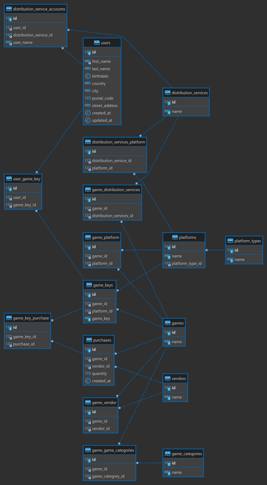

# Game Developer BobsGames's Database for Analytics and Insights!

This repo contains an example of how a relational database database with the propose of **insights and analytics** can look for a game developer.

# So what does BobsGames do?

Lets define what BobGames do and how their business works!

(Please note that all this might not accurately reflect the complexity of a real game developer :D This is all made to be simple.)

- BobsGames only business is to make and sell games
- BobsGames do not have their own shop but sell all their games via 3rd parties such as Steam, PlayStation Store and GameStop and so on. We will refer to these as **vendors**.
  Vendors such as GameStop buy games (physical copies or game keys) and sell them to customers while Steam or Playstation Store serve as a middleman for BobsGames, where BobsGames sets the price and provide the game key on purchase but Steam and Playstation Store provide all the purchase functionality such as playing orders, taking payments and so on.
- BobsGames's games are mostly played via 3rd party distribution services such as Steam, PlayStation, Epic Games, Apple (iOS) and so on. We will refer to these as **distribution services**. These also often serve as vendors. Few BobGames fans buy physical copies and play without connecting to a distribution service.
- BobsGames makes games for multiple platforms, e.g. PC, Xbox, etc
- BobsGames make games in many different categories, e.g. RPG, FPS, Strategy etc

For simplicity BobsGames does not have its own users, i.e. you cannot have a BobsGames account.

BobsGames also have a wonderful relation to its distribution services which means that they can get the following data from them:
  - name and address of user that own BobsGames's games
  - information when user play BobsGames's games
  
## Lets take a look at how users/customers get their games!

### scenario 1: Buy via online vendors which is also a distribution service

Lets say someone buys a game at Steam. Steam will take care of the order and payment, then request a game key from BobsGames. This will be registered as a new purchase in BobsGames. We will also get additional information about the purchaser, e.g. which account bought the game and additional information such as name adress etc.

### scenario 2: Buys a key online then enable it on a distribution service

Lets say someone buys a game online at GameStop and then use the key in PlayStation.

For GameStop to be able to sell BobsGames's games they have to have bought a games from BobsGames in bulk. So what the customer buys is key BobsGames have sold to GameStop. Hence, BobsGames has already a purchase registered for all those keys to GameStop, and does not get any additional information when they key is sold by GameStop to the customer. However, when the game key is activated in PlayStation, we get information we get information

### scenario 3: Buys physical copy of the game

Almost the same as scenario 2, but customer does not connect to a distribution service to access the game as it has a CD to install the game with. Hence, we do not at any point get any information about the customer.

## Lets take a look at some questions that we might be interested in getting answers for!

- How many people play our games?
- what's the most popular game?
- what's the most popular platform?
- what's the most popular game category?
- what's the most popular vendor?
- What's the average number of games owned by all game owners?
- Do poeple play BobsGames's games accross platforms? (Do they own games on both PC and console?)
- When is most games sold? On sale? On release?
- how many games have BobsGames sold that are not tied to a user?
  ...

# Database ER Diagram

# How to setup!

Database is setup using docker compose. So, just run the following command to start the database :D

`docker compose up`

dont forget to run `docker compose down` to ensure everything is cleaned up after you shut it down!

The database is mounting sql/create_tables.sql which contain all table creation SQL and sql/populate_tables.sql which adds some exampel data

# TODO

- populate all tables
- make queries for all questsion
- add more questions
- add some price information
- add some tables for storing real time information from distribution services
- add information about distribution services fees. .e.g how much does steam take per purchase?

## Some thoughts

- should steam be counted as vendors or just a distribution services. should there be a relation from steam as a vendor to steam as distribution service? Can we categorize Steam and GameStop togethere in some category and then add relations to types to differentiate them? Would this be better?

- should game keys be the index? hmm
